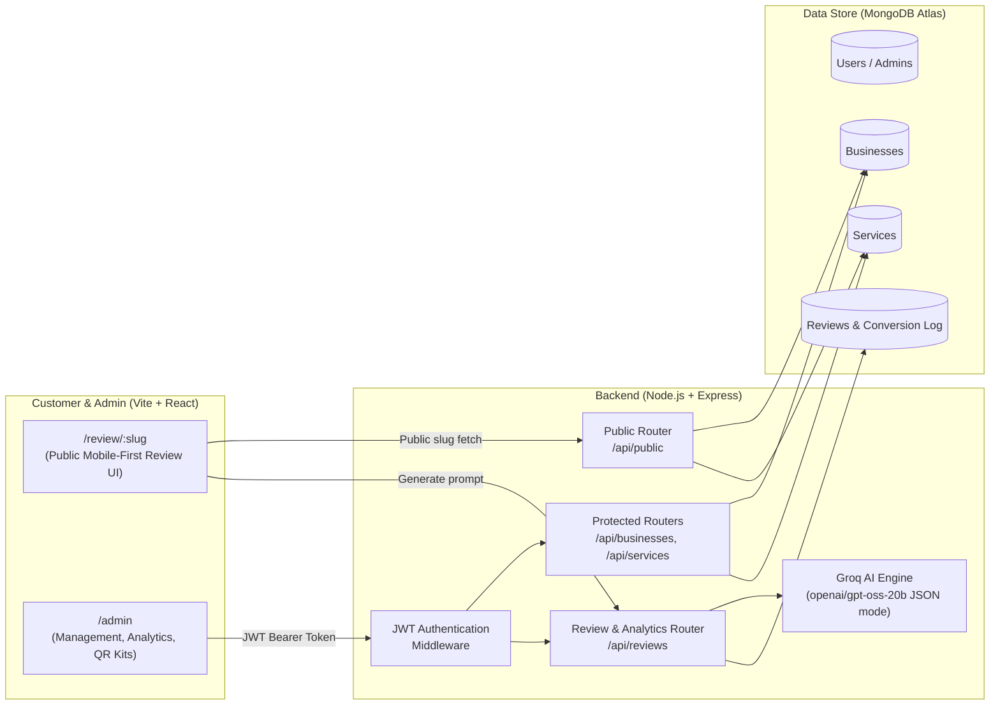

# 🌟 QuickReview — AI-Powered Google Review SaaS Platform

> **Effortlessly collect authentic 5-star Google reviews for local businesses using AI, in-store QR counter kits, and real-time conversion tracking.**

---

## 🚀 Overview

**QuickReview** is a full-stack SaaS platform designed to solve the biggest problem local businesses face: **getting customers to leave detailed, genuine Google reviews before they walk out the door.**

Instead of staring at a blank text box, customers scan an in-store tabletop QR code, select their star rating, language, and services availed, and QuickReview's AI engine instantly crafts a genuine, human-like 25-word review. With one tap of **"Copy & Post to Google"**, the review is saved to clipboard and the customer is routed directly to the business's Google Place review modal.

---

## 🛠️ Architecture & Tech Stack



### Frontend
- **Framework**: React 19 + Vite 8
- **Routing**: React Router DOM v7
- **Styling**: Vanilla CSS Design Tokens (Mobile-first, dark-accented glassmorphic tokens, zero heavy UI frameworks)
- **Icons**: Lucide React
- **QR Generation**: High-resolution vector/canvas QR Code generator with A4 print-ready acrylic standee simulator

### Backend
- **Runtime**: Node.js + Express
- **Database**: MongoDB with Mongoose ODM
- **AI Engine**: Groq SDK (`openai/gpt-oss-20b` with structured JSON mode and sentiment mapping)
- **Security**: JWT (JSON Web Token) + BcryptJS password salting (10 rounds)

---

## ✨ Key Features

### 1. 📱 Customer-Facing Review Experience (`/review/:slug`)
- **Zero App Install**: 100% web-based, optimized for mobile phone cameras.
- **Dynamic Star Sentiment**: Dynamically tunes sentiment and tone (5★ strongly positive, 4★ positive, 3★ balanced, 1-2★ constructive feedback).
- **Multi-Language Support**: English, Hindi, Gujarati, Spanish, French, German, and more.
- **Service Tags**: Customers tap what services they used (e.g. "Screen Repair", "Root Canal", "Espresso").
- **One-Click Handoff**: Copies text to clipboard and opens the exact Google Review link with zero friction.

### 2. 🛡️ Enterprise Admin Management Portal (`/admin`)
- **Secure Access**: JWT protected admin routes with auto-token refresh and interceptors.
- **KPI Metrics Overview**: Global and per-business stats (Total Generations, Avg Rating, Google Conversion Rate).
- **Business Management**: Configure business profile, address, categories, and direct Google Review URLs.
- **Service/Experience Catalog**: Add, search, and toggle active/inactive status for services with optimistic updates.
- **Modern Dialogs & Toasts**: Replaced all native browser alerts with custom floating toast notifications and confirmation dialogs.

### 3. 🖨️ In-Store QR Counter Kits & Printable Tabletop Standees
- **Instant High-Res QR**: One-click download of high-resolution QR PNG for marketing materials.
- **Print-Ready Tabletop Standee**: Built-in CSS `@media print` acrylic counter standee flyer with Google 5-star branding and step-by-step customer instructions. Ready to print directly on A4 paper!

### 4. 📊 Real-Time Analytics & ROI Tracking
- **Conversion Attribution**: Tracks when customers click "Copy & Post to Google" to compute true funnel conversion rates.
- **Rating Distribution**: Visual 5-to-1 star distribution bars.
- **Language Analytics**: Real-time breakdown of languages requested by customers.
- **Review Feed Table**: Historical audit log of all generated reviews with timestamps.

---

## ⚡ Quick Start Guide

### Prerequisites
- [Node.js](https://nodejs.org/) (v18 or higher)
- [MongoDB Atlas](https://www.mongodb.com/cloud/atlas) or local MongoDB
- [Groq API Key](https://console.groq.com/)

### 1. Backend Setup

```bash
cd backend
npm install
```

Create a `.env` file in `backend/` (or copy `.env.example`):

```env
MONGO_URI=your_mongodb_connection_string
PORT=5000
GROQ_API_KEY=your_groq_api_key
JWT_SECRET=your_super_secret_jwt_key
```

Start the backend server:

```bash
# Development (with nodemon)
npm run dev

# Production
npm start
```


---

### 2. Frontend Setup

```bash
cd frontend
npm install
```

Create a `.env` file in `frontend/` (optional for development, defaults to `http://localhost:5000`):

```env
VITE_API_URL=http://localhost:5000
```

Start the Vite dev server:

```bash
npm run dev
```

Open your browser at `http://localhost:5173`.

---

## 🔑 Default Credentials & Routes

| Route | Role | Purpose |
| :--- | :--- | :--- |
| `/admin/login` | Public | Admin login page with 1-click demo autofill |
| `/admin` | Admin | Dashboard with global analytics and client business cards |
| `/admin/business/:id` | Admin | Multi-tab business manager (Profile, Services, QR Kit, Analytics) |
| `/review/:slug` | Customer | Public review generation page (e.g. `/review/test-mobile-store`) |

---

## 📡 API Reference

### Public APIs
- `GET /api/public/business/:slug` — Fetch business details and active services for the review page.
- `POST /api/reviews/generate` — Generate AI review via Groq model and log to MongoDB.
- `POST /api/reviews/track-copy/:reviewId` — Increment conversion tracking when copied to Google.
- `GET /api/health` — Service health check.

### Authentication APIs
- `POST /api/auth/login` — Login admin and receive JWT token.
- `POST /api/auth/register` — Register a new admin.
- `GET /api/auth/me` — Fetch currently authenticated user profile.

### Protected Admin APIs (Requires `Authorization: Bearer <token>`)
- `GET /api/businesses` — List all registered businesses.
- `POST /api/businesses` — Create a new business.
- `GET /api/businesses/:id` — Get single business details.
- `PUT /api/businesses/:id` — Update business profile & Google URL.
- `DELETE /api/businesses/:id` — Delete business and associated records.
- `GET /api/services/business/:businessId` — List services for a business.
- `POST /api/services` — Create a service.
- `PUT /api/services/:id` — Update / toggle active status.
- `DELETE /api/services/:id` — Delete a service.
- `GET /api/reviews/analytics/global` — Global dashboard metrics.
- `GET /api/reviews/analytics/:businessId` — Business-specific analytics.

---

## 🚢 Production Deployment

### Frontend (Vercel / Netlify)
1. Set the root directory to `frontend`.
2. Build command: `npm run build`.
3. Output directory: `dist`.
4. Environment variable: `VITE_API_URL=https://your-backend-api.onrender.com`.

### Backend (Render / Railway)
1. Set the root directory to `backend`.
2. Build command: `npm install`.
3. Start command: `npm start`.
4. Add environment variables: `MONGO_URI`, `GROQ_API_KEY`, `JWT_SECRET`, `PORT=5000`.

---

## 📄 License
ISC License. Built with ❤️ for local businesses.
